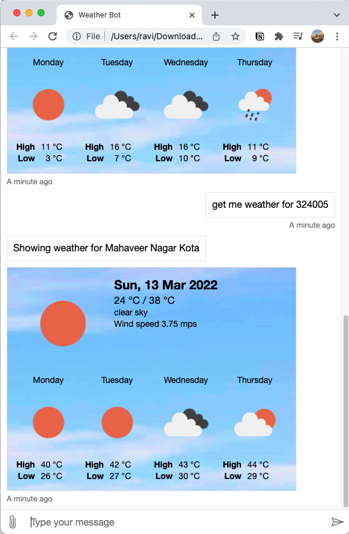

# Welcome to Weather Bot

### How to setup

1. clone the repo
2. connect it to your luis resource
3. Get the weather api key from [Open Weather Map](https://openweathermap.org/)

Note: I have revoked the api access key, so it won't work. You need your own key.

### Features

1. NLP powered bot with help of LUIS.
   example:
1. get me weather of delhi

    - bot recognization delhi as a location, and it gets coordinates of delhi, and then fetches the weather data for this coordinates.

2. weather at 110001

    - bot recognization this as Indian pin code since it has 6 digit in it, and it first gets the location and coordinates, then fetches the weather data for this coordinates.

3. show me weather for 84044

    - bot recognization this as USA zip code since it has 5 digit in it, and it first gets the location and coordinates, then fetches the weather data for this coordinates.

You can try more examples, and share that here. 2. It can be easily deployed on any existing or new website using the webchatJs library provided by Microsoft.

3. It can be easily integrated with MS Teams as well using the channel configuration on Azure Portal.
   
   
   
